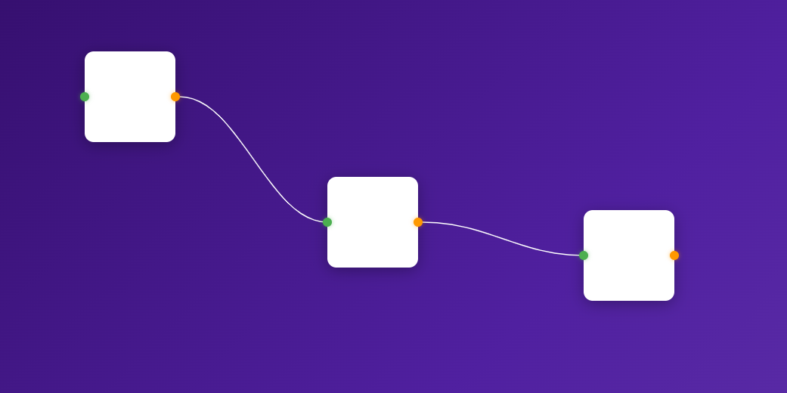

# ⚡ Internodos UI

### La interfaz visual para conectar el mundo digital 🌐

InterAPI UI es un editor visual de nodos construido con **Svelte** que permite diseñar interconexiones entre APIs, servicios y sistemas de manera intuitiva — arrastrando, soltando y conectando.

---

## 🧩 ¿Qué es?

En el mundo real, los sistemas no viven aislados. Tu base de datos habla con un servicio, ese servicio alimenta otro, y ese otro dispara una notificación. **InterAPI UI** nace de la idea de visualizar y orquestar esas conexiones de forma clara y elegante.

Cada **nodo** representa un punto de información — una API, un servicio, un webhook, un proceso. Las **líneas** entre ellos representan el flujo de datos, la relación, la dependencia.



---

## ✨ Características

🔲 **Nodos arrastrables** — Crea y mueve nodos libremente dentro del área de trabajo  
🟢 **Entradas** — Punto verde que recibe conexiones de otros nodos  
🟠 **Salidas** — Punto naranja desde donde nacen las conexiones  
🔗 **Conexiones visuales** — Líneas curvas Bézier que unen salidas con entradas  
✋ **Drag & Drop intuitivo** — Arrastra desde un punto naranja hacia uno verde para conectar  
🗑️ **Eliminación fácil** — Click derecho sobre la línea o los puntos para desconectar  
🎯 **Feedback visual** — Los puntos de entrada crecen al acercar una conexión  
🎬 **Animaciones suaves** — Efectos de pickup y drop con anime.js  
📦 **Crear nodos al vuelo** — Botón "Crear" para agregar nuevos nodos al instante  

---

## 🚀 Tech Stack

| Tecnología | Uso |
|---|---|
| 🟧 **SvelteKit** | Framework principal |
| 🟦 **TypeScript** | Tipado estático |
| 🎞️ **anime.js** | Animaciones fluidas |
| 🖼️ **SVG** | Renderizado de conexiones |

---

## 🛠️ Instalación

```bash
# Clonar el repo
git clone https://github.com/moibe/interapi-ui.git

# Instalar dependencias
npm install

# Iniciar servidor de desarrollo
npm run dev -- --open
```

---

## 🧠 La visión

InterAPI UI no es solo un editor de nodos — es una forma de **pensar en sistemas**. Cada cuadro es una pieza del rompecabezas digital. Cada línea es un puente entre mundos.

> 🔌 *Conecta lo que antes estaba separado.*

Ya sea que estés diseñando una arquitectura de microservicios, mapeando flujos de datos o simplemente visualizando cómo interactúan tus APIs — este es tu espacio de trabajo.

---

## 📋 Roadmap

- [ ] 🏷️ Nombres editables en los nodos
- [ ] 🎨 Colores personalizables por nodo
- [ ] 💾 Persistencia de estado
- [ ] 📤 Exportar configuración
- [ ] 🔄 Ejecución real de flujos entre APIs
- [ ] 🧪 Modo de prueba de conexiones

---

Hecho por Moibe 🧑🏻‍🚀

> To deploy your app, you may need to install an [adapter](https://svelte.dev/docs/kit/adapters) for your target environment.
